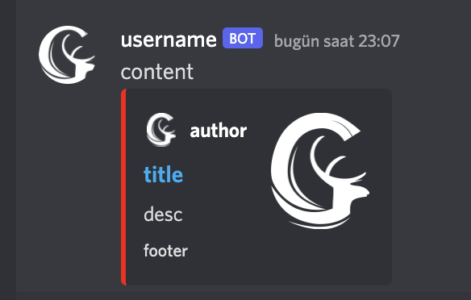

# Discord-Webhook
[](https://github.com/poyrazinan/Discord-Webhook/actions/workflows/maven.yml)
[](https://jitpack.io/#poyrazinan/Discord-Webhook)

Discord Webhook library which create object and execute it.

## Usage

### Maven Repo

#### Repository
```xml
<repository>
    <id>jitpack.io</id>
    <url>https://jitpack.io</url>
</repository>
```

#### Dependency
```xml
<dependency>
    <groupId>com.github.poyrazinan</groupId>
    <artifactId>Discord-Webhook</artifactId>
    <version>1.0.3</version>
</dependency>
```

### Gradle Repo
#### Repository
```
maven { url 'https://jitpack.io' }
```
#### Dependency
```
implementation 'com.github.poyrazinan:Discord-Webhook:1.0.3'
```

### Code Example

* Creating object and execute

```java
import xyz.geik.webhook.discord.Webhook;

public static class Test {
    public static void main(String[] args) {
        Webhook webhook = new Webhook(
                "dataId", // Not Necessary
                "webhookUrl", // Webhook url which should be taken from discord integrations tab
                "userName", // Webhook username who sends
                "photoUrl", // Webhook profile photo who sends
                "thumbnail", // Thumbnail photo in embed
                "authorName", // gets photo from photoUrl and gets link from webUrl
                "description", // Embed message
                "content", // which is not in embed.
                "footer", // Footer text
                "color", // Possibilities (ORANGE, RED, BLACK, GREEN, YELLOW, CYAN, WHITE and BLUE )
                "webUrl" // Website url
        );
        // Execute webhook
        webhook.execute();
    }
}
```

## Photo of Webhook

